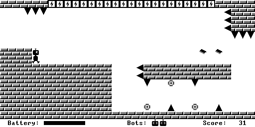

# nand2tetris-polarity

A one-button platform game written for the Nand2Tetris system.

This program is written in the Jack programming language, which is part
of the computer system and software stack designed for the course [From
Nand to Tetris -- Building a Modern Computer From First Principles][1].

This is currently a "minimal viable game" containing a single level.
I intend to expand the game with multiple levels, a title screen, demo
mode, and maybe some kind of final boss, after I finish the Nand2Tetris
course.

This repository contains the source code for the game itself, as well as
a simple tool used to create stages (worlds) for the game. This tool is
a first draft I made in an afternoon, so it's a bit rough around the
edges.

[1]: https://www.nand2tetris.org/
